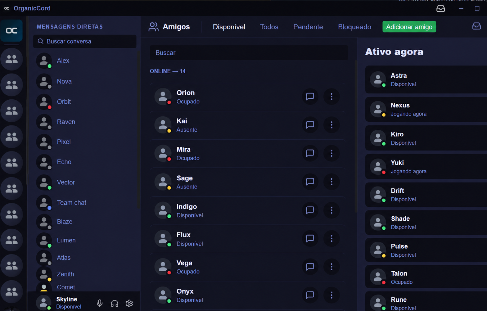

<h1>
  
  OrganicCord
</h1>

An open-source, lightweight, multi-account desktop client for Discord on Windows. OrganicCord brings conversations, communities, voice, presence, and notifications into a focused native desktop experience built with Tauri, Rust, React, and TypeScript.

> [!WARNING]
> OrganicCord is an **unofficial** Discord client. Discord does not provide a public, supported API for complete user clients, so service changes can affect compatibility. Do not use this project for account automation, spam, data harvesting, or self-bots. Keep the official Discord client available for important accounts.

<p align="center">
  
</p>

*An anonymized preview of the OrganicCord Friends interface.*

## Beta status

OrganicCord is currently published as [`v0.2.0-beta.2`](https://github.com/aMathyzinn/OrganicCord/releases/tag/v0.2.0-beta.2). The beta covers the core communication and voice flows, but it is not intended to match every feature of the official Discord client.

| Available now | Not available yet |
| --- | --- |
| Messages, DMs, servers, friends, and presence | Video calls |
| Voice calls in DMs and voice channels | Screen sharing / Go Live |
| Attachments, reactions, replies, polls, and forums | Activities, soundboard, and Stage Channels |
| Native notifications, themes, shortcuts, and multi-account sessions | Automatic updates and official Linux/macOS support |

## Install on Windows

1. Download `OrganicCord_0.2.0-beta.2_x64-setup.exe` from the [release page](https://github.com/aMathyzinn/OrganicCord/releases/tag/v0.2.0-beta.2).
2. Run the installer on a Windows 10 or Windows 11 computer with WebView2 installed.
3. Sign in and grant only the permissions required by the features you choose to use.

The current installer is not code-signed yet. Windows may show an unknown publisher warning; verify that the file came from the official release and check its hash before installing. Do not disable Windows security features to run the app.

```powershell
Get-FileHash .\OrganicCord_0.2.0-beta.2_x64-setup.exe -Algorithm SHA256
```

`v0.2.0-beta.2` SHA-256:

```text
4C0628E533631F2338F68DE997014B2BB8840FBCCDD22D34C8DB4D9CF50DED52
```

## What you can do

### Conversations and communities

- Use multiple Discord accounts from one application and switch between them quickly.
- Browse servers, organize them into folders, and access text, voice, and forum channels.
- Send, reply to, edit, and delete your own messages.
- Upload files and images, record voice messages, and view embeds.
- Use emojis, reactions, polls, pinned messages, search, and Markdown formatting.
- Chat through DMs, archive conversations, and view typing indicators, presence, and profiles.
- Manage friends, block users, and create server invites when you have permission.

### Voice

- Start, receive, answer, and decline direct-message voice calls.
- Join and leave server voice channels.
- Select audio input and output devices, test the microphone, and enable RNNoise suppression.
- Mute, deafen, follow participants, and inspect the active connection state.

Voice transport uses Opus. A call is only treated as connected after the voice gateway, encrypted transport, and DAVE protection have completed their negotiation; a visible UI state alone is not proof of a working call.

### Desktop experience

- Receive native Windows notifications, mention alerts, and unread indicators.
- Mute servers, channels, or users for a chosen duration.
- Customize themes, contrast, density, message size, app icon, and keyboard shortcuts.
- Update your avatar, bio, and profile color. Image banners remain subject to Discord account eligibility.
- Detect local games and publish Rich Presence through an open Discord Desktop client.

## Technical architecture

```text
React + TypeScript + Zustand
        │ UI and local state
        ▼
Tauri 2 — typed commands and events
        │
Rust — sessions, REST, Gateway, permissions, voice, and files
        │
Discord API v10 · Gateway · Voice Gateway
```

| Layer | Responsibility |
| --- | --- |
| React + Zustand | Interface, navigation, message cache, and call state. |
| Tauri | Typed bridge between the frontend and native Windows capabilities. |
| Rust | Sessions, REST, Gateway handling, rate limits, permissions, audio, and attachment handling. |
| Gateway v10 | Real-time events, heartbeats, reconnection, and session resume. |
| Voice | Opus, audio devices, encrypted RTP transport, and fail-closed DAVE negotiation. |

Permissions are evaluated across server, role, member, and channel overrides. Request limits are coordinated per route, with separate handling for global rate limits.

## Security and privacy

- The frontend does not receive or persist Discord account tokens.
- Local credentials are encrypted, with keys protected by the operating system.
- Files selected in Windows become opaque, temporary identifiers with expiration and size limits before they are uploaded.
- The Content Security Policy restricts script, connection, media, and embedded-navigation origins.
- External links are validated and require confirmation before the default browser is opened.

These measures reduce the attack surface, but do not eliminate the risks inherent to an unofficial client. Read the [Security Policy](SECURITY.md) to report vulnerabilities.

## Development

### Requirements

- Windows 10 or 11 with WebView2;
- Node.js 24 (`>=24 <25`);
- Rust `1.89.0` MSVC, pinned in [`rust-toolchain`](rust-toolchain);
- Visual Studio C++ Build Tools for the audio backend.

### Run locally

```bash
npm ci
npm run tauri:dev
```

### Validate the project

```bash
npm run type-check
npm run lint
npm test
npm run build

cd src-tauri
cargo fmt --all -- --check
cargo clippy --all-targets --all-features -- -D warnings
cargo test --all-targets
cargo audit
```

### Build a local NSIS installer

```powershell
$env:CARGO_TARGET_DIR = "$PWD\src-tauri\target-installer"
npm run tauri:build -- --bundles nsis
```

Using an isolated build directory avoids conflicts with an already-running OrganicCord instance. Always verify an installer by version, timestamp, and SHA-256 before distributing it.

## Documentation and contributing

- [Contributing guide](CONTRIBUTING.md)
- [Security policy](SECURITY.md)
- [Release checklist](RELEASE_CHECKLIST.md)
- [Official repository](https://github.com/aMathyzinn/OrganicCord)
- [Creator portfolio](https://damodara.xyz)

Protocol changes should reference official documentation whenever available, include tests, and avoid compatibility claims without real transport, encryption, and media evidence.

## License

OrganicCord is released under the MIT License. The adapted copy of [`hpke-rs`](src-tauri/vendor/hpke-rs) remains under MPL-2.0; see its [`PATCH.md`](src-tauri/vendor/hpke-rs/PATCH.md).
